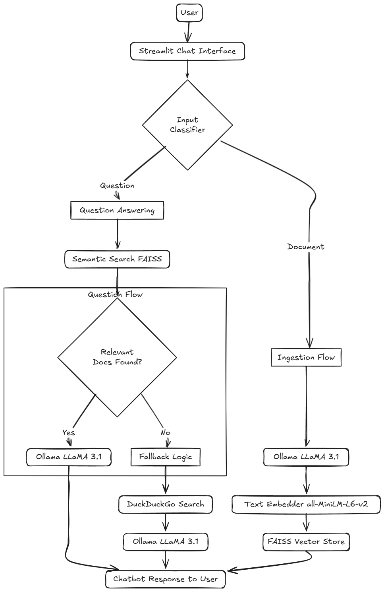

# Concert Tour Assistant

Smart AI assistant that helps users ingest concert tour documents and ask questions about 2025–2026 events using a local Retrieval-Augmented Generation (RAG) system. If no answer is found internally, the assistant will automatically search the web to provide a useful response.

## Core Features

-   Accepts concert tour data directly as prompt input

-   Uses a local **RAG system** with FAISS + `all-MiniLM-L6-v2`(low memory and fast) embedder

-   Embeds and retrieves document chunks based on **semantic similarity**

-   Supports natural language Q&A

-   Falls back to **web search via DuckDuckGo** when RAG has no answer

-   Built-in **chat memory** and simple UI

-   Entirely local – no API keys required

## Demo


## Architecture



## Project Structure

```
├── app.py                 ← Streamlit UI
├── main_router.py         ← Input routing + fallback logic
├── ingestion/             ← Document filtering
├── qa/                    ← RAG pipeline
├── search/                ← DuckDuckGo integration
├── utils/                 ← Ollama, input classifiers, etc.
├── vector_store/          ← FAISS index and metadata
└── desc_components/
    └── example.mp4        ← Demo video
    └── architecture.png   ← Project architecture
```

## Planned Improvements

-   Add file upload support for .pdf, .docx, and .txt
-   Chunk long documents into multiple vector entries
-   Stream responses word-by-word
-   Add user settings(e.g., model selection, web search toggle)

## How to Run Locally

### 1. Clone the Repository

```bash
git clone https://github.com/davydantoniuk/ProvectusInternship_DavydAntoniuk
cd ProvectusInternship_DavydAntoniuk
```

### 2. Install and Run Ollama

1. Download and install Ollama: https://ollama.com/download
2. Pull the LLaMA 3 model:

```bash
ollama pull llama3.1:latest
```

3. Start the Ollama server:

```bash
ollama serve
```

### 3. Install Dependencies

```bash
pip install -r requirements.txt
```

### 4. Run the Application

```bash
streamlit run app.py
```

Your browser will open the assistant at: `http://localhost:8501`.
